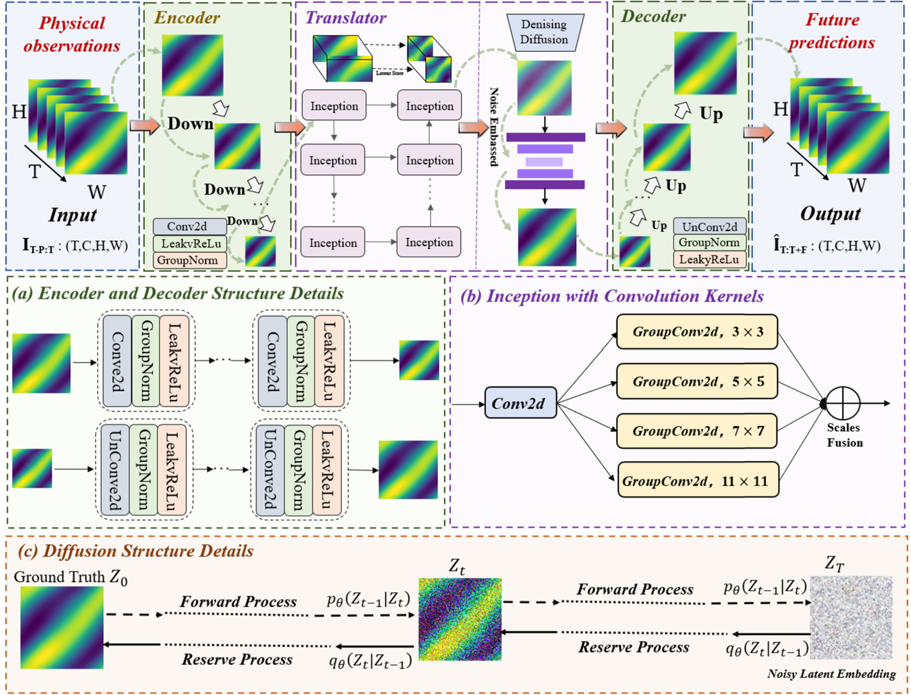

# 🌀 ConvDiff

### Multi-scale Spatio-temporal Convolutional Networks with Latent Diffusion Models for Dynamic System Modeling

`5 dataset families · 8 benchmark settings · 4 metrics · 8 temporal modules · 4 spatial modules`

[Overview](#overview) • [Architecture](#architecture) • [Results](#results) • [Structure](#structure) • [Getting Started](#getting-started) • [Training](#training) • [Reproduction](#reproduction) • [Audit](#paper-code-alignment-audit)

</div>

---

[](Figures/framework.png)

This repository contains the implementation associated with **ConvDiff**, a fully convolutional framework for forecasting spatio-temporal dynamical systems. ConvDiff combines:

- a hierarchical **encoder-decoder** for spatial compression and reconstruction;
- a multi-scale **translator** built from Inception-style convolutions with kernels from `3×3` to `11×11`;
- a latent-space **diffusion/noise module** intended to model uncertainty in complex physical evolution.

The paper evaluates ConvDiff on urban traffic, moving digits, storm imagery, fluid dynamics and fire-dynamics data. It reports state-of-the-art or best-in-table results across the principal benchmarks, including **MSE 0.29 / PSNR 40.31 on TaxiBJ** and a **51.15% MSE reduction on Navier-StokesT20** relative to the strongest listed baseline.

> **Paper:** Yuyang Zhao, Yuhan Wu and Yongmei Wang, “ConvDiff: Multi-scale spatio-temporal convolutional networks with latent diffusion models for dynamic system modeling,” *Information Sciences*, vol. 723, 122656, 2026. [DOI](https://doi.org/10.1016/j.ins.2025.122656)
>
> **Code:** [github.com/Ray-zyy/ConvDiff](https://github.com/Ray-zyy/ConvDiff)
>
> **Data:** [huggingface.co/Ray6666/Convdiff](https://huggingface.co/Ray6666/Convdiff)

---

<a id="overview"></a>

## 🌟 Overview

Spatio-temporal dynamic systems are difficult to forecast because they combine three sources of complexity:

| Challenge | Why it matters | ConvDiff response |
| --- | --- | --- |
| Multi-scale spatial structure | Local motion and global patterns evolve at different receptive fields | Parallel `3×3`, `5×5`, `7×7`, and `11×11` convolutions |
| Nonlinear temporal evolution | Future states depend on long and interacting histories | Deep translator with eight temporal modules and skip-connected encoding/decoding |
| Physical uncertainty | Traffic, fluid flow, storms and fire do not evolve deterministically | Noise-based latent diffusion mechanism |
| High-dimensional grids | Direct modeling in pixel/state space is expensive | Four-stage encoder compresses before translation and diffusion |
| Long-horizon degradation | Small one-step errors accumulate and blur later predictions | Hierarchical feature extraction and latent-space refinement |

The model maps a historical sequence

```text
X ∈ R^(B×T×C×H×W)
```

to a future sequence of the same spatio-temporal layout:

```text
X → Encoder → Multi-scale Translator → Latent Diffusion → Decoder → Ŷ
```

The released implementation requires equal input and target sequence lengths because its output preserves the input time dimension `T`.

---

<a id="structure"></a>

## 📁 Repository Structure

The current GitHub snapshot is compact and differs from the package paths assumed by its own imports:

```text
ConvDiff/
├── Main.py                              # training/testing entry point
├── Config.py                            # CLI arguments and default hyperparameters
├── Model.py                             # ConvDiff, encoder, translator, decoder, DDIM noise
├── Engine.py                            # train / validation / test loops
├── Metrics.py                           # MSE, MAE, SSIM, PSNR
├── Recorder.py                          # best-validation checkpoint recorder
├── Until.py                             # seed, log directory and logger utilities
├── README.md                            # two-line upstream README
│
├── Dataloader/
│   ├── Data_preparation.py              # dataset dispatch
│   ├── Dataloader.py                    # generic loader / prefetch utilities
│   ├── Dataloader_MovingMNIST.py        # generated train set + fixed test set
│   ├── Dataloader_TaxiBJ.py             # TaxiBJ .npz loader
│   ├── Dataloader_NavierStockT20.py     # MATLAB v7 Navier-Stokes loader
│   ├── Dataloader_NavierStockT30_50.py  # HDF5/MATLAB v7.3 loader
│   ├── Dataloader_SEVIR.py              # SEVIR .npy loader
│   └── Dataloader_file.py               # generic fire/FDS .npy loader
│
└── Figures/
    └── framework.png                    # paper Fig. 1
```

### Core classes

| File | Class/function | Purpose |
| --- | --- | --- |
| `Model.py` | `Convdiff` | end-to-end forecast model |
| `Model.py` | `Encoder` / `Decoder` | spatial compression and reconstruction |
| `Model.py` | `Mid_Xnet` | multi-scale translator with skip connections |
| `Model.py` | `Inception` | four parallel grouped-convolution kernels |
| `Model.py` | `DDIM` | linear-schedule forward latent noising |
| `Engine.py` | `Engine` | optimization, validation, checkpoint test |
| `Recorder.py` | `Recorder` | retain lowest validation-loss state |
| `Dataloader/Data_preparation.py` | `load_data` | select dataset-specific loader |

---

<a id="getting-started"></a>

## 🚀 Getting Started

### 1. Clone the repository

```bash
git clone https://github.com/Ray-zyy/ConvDiff.git
cd ConvDiff
```


### 2. Create the environment

The repository does not currently provide `requirements.txt`. A practical starting environment is:

```bash
conda create -n convdiff python=3.10 -y
conda activate convdiff

# Install PyTorch/torchvision for your CUDA version first, then:
pip install numpy scipy h5py scikit-image timm tqdm matplotlib
```

The paper reports experiments on one **NVIDIA V100 32 GB**, using PyTorch.

### 3. Download the data selectively

The linked Hugging Face repository stores the datasets with Git LFS. Several files are multi-gigabyte, so avoid cloning every payload unless needed.

```bash
git lfs install
GIT_LFS_SKIP_SMUDGE=1 git clone https://huggingface.co/Ray6666/Convdiff data_source
cd data_source

# Example: fetch only TaxiBJ
git lfs pull --include="Data/TaxiBJ.npz"
```

Available payloads:

```text
Data/
├── MovingMNIST.zip
├── TaxiBJ.npz
├── NavierStockT20.mat
├── NavierStockT30.mat
├── NavierStockT50.mat
├── SEVIR.npy
├── Prometheus-P.npy
└── Prometheus-T.npy
```

### 4. Match the loader’s expected paths

The filenames in the data repository do not exactly match the code defaults.

| Data file | Loader expectation |
| --- | --- |
| `TaxiBJ.npz` | place as `<data_root>/taxibj/dataset.npz` |
| `MovingMNIST.zip` | extract so `<data_root>/moving_mnist/train-images-idx3-ubyte.gz` and `mnist_test_seq.npy` exist |
| `NavierStockT20.mat` | pass the exact `.mat` path as `--data_root` |
| `NavierStockT30.mat` / `T50.mat` | pass the exact HDF5-style `.mat` path |
| `SEVIR.npy` | rename/place as `<data_root>/sevir_dataset.npy` |
| `Prometheus-P.npy` / `T.npy` | no paper-aligned loader is exposed by the current CLI |

---

## ⚠️ Before Running the Current Snapshot

The repository is **not runnable as cloned on a case-sensitive Linux system**. `Main.py` expects lower-case modules and package folders that are absent from the upload. Apply the following structural corrections or equivalent import edits:

```text
Current file                         Import expected by the code
──────────────────────────────────   ─────────────────────────────────
Config.py                            config.py
Engine.py                            engine.py
Until.py                             utils/utils.py
Metrics.py                           utils/metrics.py
Recorder.py                          utils/recorder.py
Model.py                             models/model4.py
Dataloader/Data_preparation.py       utils/data_preparation.py
Dataloader/Dataloader.py             utils/dataloader.py
Dataloader/Dataloader_TaxiBJ.py      utils/dataloader_taxibj.py
Dataloader/Dataloader_MovingMNIST.py utils/dataloader_moving_mnist.py
Dataloader/Dataloader_NavierStockT20.py
                                     utils/dataloader_navier.py
Dataloader/Dataloader_NavierStockT30_50.py
                                     utils/dataloader_navierv1.py
Dataloader/Dataloader_SEVIR.py       utils/dataloader_sevir.py
Dataloader/Dataloader_file.py        utils/dataloader_file.py
```

Also remove or comment the four unavailable baseline imports in `Main.py`:

```python
from models.simvp import SimVP
from models.ConvLSTM import ConvLSTM
from models.UNet import UNet
from models.eartherformer_model import CuboidTransformerModel
```

Only `Convdiff` is instantiated by the entry point; the baseline source files are not included.

### CLI corrections

`Config.py` exposes only:

```python
choices=['mmnist', 'taxibj', 'caltech', 'navier']
```


---

## ⚡ Quick Start — Model-only Smoke Test

Before wiring the data pipeline, verify the core network independently:

```bash
python - <<'PY'
import torch
from Model import Convdiff

shape = (4, 2, 32, 32)               # TaxiBJ: T,C,H,W
model = Convdiff(shape, hid_S=64, hid_T=256, N_S=4, N_T=8)
x = torch.randn(1, *shape)

with torch.no_grad():
    y = model(x)

print("input :", tuple(x.shape))
print("output:", tuple(y.shape))       # (1,4,2,32,32)
PY
```

For GPU use, register the diffusion schedule tensors as buffers or move them before indexing; the current `DDIM.alpha_hats` tensor is created on CPU and is not a registered model buffer.

---

<a id="training"></a>

## 🏋️ Training

After correcting the package layout, one TaxiBJ run follows the repository defaults:

```bash
python Main.py \
    --dataname taxibj \
    --data_root ./data/ \
    --in_shape 4 2 32 32 \
    --batch_size 4 \
    --val_batch_size 4 \
    --hid_S 64 \
    --hid_T 256 \
    --N_S 4 \
    --N_T 8 \
    --epochs 300 \
    --lr 0.01 \
    --gpu 0
```

### Training protocol

| Component | Setting |
| --- | --- |
| Optimizer | Adam |
| Initial learning rate | `0.01` |
| Scheduler | OneCycleLR |
| Epochs | `300` |
| Batch size | `4` in repository; paper says `4/8` depending on dataset |
| Objective | `torch.nn.MSELoss()` |
| Validation | at every epoch by default (`log_step=1`) |
| Model selection | minimum validation loss |
| Seed | `1` |
| Default device | `cuda:0` |

The output directory is timestamped:

```text
workdir/<model-label>/<dataset>/<YYYYMMDDHHMMSS>/
├── run.log
└── <dataset>_<model-label>_best_model.pth
```

`--model` only changes the log/checkpoint label in the current entry point; `Main.py` always constructs `Convdiff`.

### Expected input/target contracts

Every batch must provide:

```python
batch_x.shape == (B, T, C, H, W)
batch_y.shape == (B, T, C, H, W)
```

Because the released model preserves `T`, unequal input and prediction lengths will cause the MSE loss to fail unless the model or loader is modified.

---

## 🧪 Evaluation

After training, `Engine.test()` automatically reloads the best validation checkpoint and reports:

```text
Test MSE:..., MAE:..., SSIM:..., PSNR:...
```

Set `--is_save_data` in code to save:

```text
inputs.npy
trues.npy
preds.npy
```

### Metric definitions in the repository

| Metric | Code behavior | Direction |
| --- | --- | --- |
| MSE | mean over batch/time, then sum over remaining axes | lower |
| MAE | mean over batch/time, then sum over remaining axes | lower |
| SSIM | per-frame `skimage` SSIM, averaged over batch/time | higher |
| PSNR | per-frame uint8-scaled PSNR, averaged over batch/time | higher |


---

<a id="reproduction"></a>

## 🔁 Reproduction Guide

### Paper-aligned experiment grid

| Setting | Input/output | Suggested `in_shape` | Loader status in snapshot |
| --- | --- | --- | --- |
| MovingMNIST | 10 → 10 | `10 1 64 64` | available, split differs from paper |
| TaxiBJ | 4 → 4 | `4 2 32 32` | available |
| Navier-StokesT20 | 10 → 10 | `10 1 64 64` | available, random 80/20 split |
| Navier-StokesT30 | 10 → 10 | `10 1 64 64` | loader exists but CLI choice missing |
| Navier-StokesT50 | 10 → 10 | `10 1 64 64` | loader exists but CLI choice missing |
| SEVIR | paper 10 → 10 | paper: `10 1 64 64` | code slices 12 → 12 |
| Prometheus-b1 | 15 → 15 | `15 3 128 256` | no paper-aligned dispatcher |
| Prometheus-b2 | 25 → 25 | `25 3 128 256` | no paper-aligned dispatcher |


### Result record template

```csv
dataset,seed,input_steps,pred_steps,hid_S,hid_T,N_S,N_T,checkpoint,mse,mae,ssim,psnr
TaxiBJ,1,4,4,64,256,4,8,...,...,...,...,...
```

---

## 🧩 Using ConvDiff in Your Own Code

The core model is self-contained in `Model.py` and can be integrated without the repository’s training entry point:

```python
import torch
from Model import Convdiff

model = Convdiff(
    shape_in=(10, 1, 64, 64),
    hid_S=64,
    hid_T=256,
    N_S=4,
    N_T=8,
    incep_ker=[3, 5, 7, 11],
    groups=8,
)

history = torch.randn(4, 10, 1, 64, 64)
forecast = model(history)
assert forecast.shape == history.shape
```

For a deterministic ablation, bypass `self.ddim(hid, t)` or replace it with a learned denoising module. For a paper-faithful diffusion model, add:

1. a time-conditioned noise predictor/denoiser;
2. the forward `q(F_t | F_0)` sampling equation;
3. an explicit noise/VLB training objective;
4. an iterative reverse sampler for inference;
5. deterministic evaluation seeds or multi-sample probabilistic metrics.

---

## 📚 Citation

```bibtex
@article{zhao2026convdiff,
  title   = {ConvDiff: Multi-scale spatio-temporal convolutional networks with latent diffusion models for dynamic system modeling},
  author  = {Zhao, Yuyang and Wu, Yuhan and Wang, Yongmei},
  journal = {Information Sciences},
  volume  = {723},
  pages   = {122656},
  year    = {2026},
  doi     = {10.1016/j.ins.2025.122656}
}
```

---

## 🙏 Acknowledgements

The experimental study compares ConvDiff with or builds on ideas from:

- **ConvLSTM** — convolutional recurrent spatio-temporal prediction
- **SimVP** — fully convolutional video prediction
- **Earthformer** — space-time transformer forecasting
- **U-Net**, **ResNet**, and **Vision Transformer** — visual backbones
- **FNO** and **CNO** — neural operator learning

